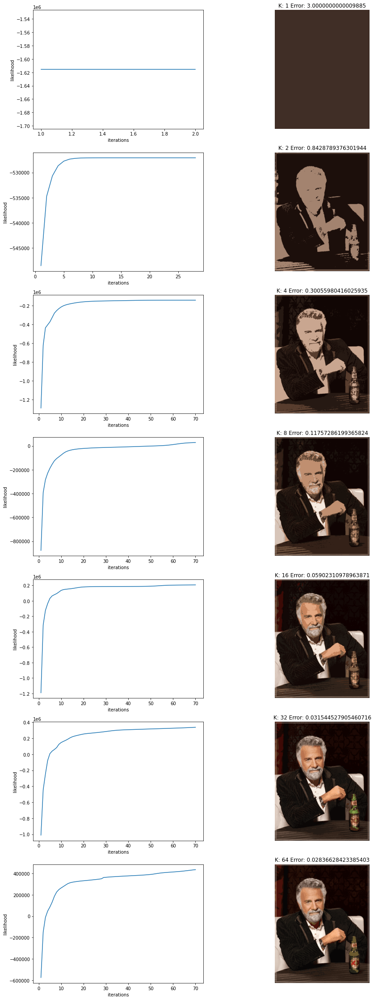

# Machine Learning Assignment 2: Image Segmentation
## Expectation maximization algorithm


```python
from functions import run_EM, plot

from PIL import Image
```


```python
K = [1, 2, 4, 8, 16, 32, 64]
maxIters = 70

path = "im.jpg"
im = Image.open(path)
im
```


    

    


```python
results, errors = run_EM(im, K, maxIters)
```

    100%|███████████████████████████████████████████████████████████████████████████████████| 7/7 [21:42<00:00, 186.12s/it]
    


```python
plot(K, results, errors)
```


    

    

